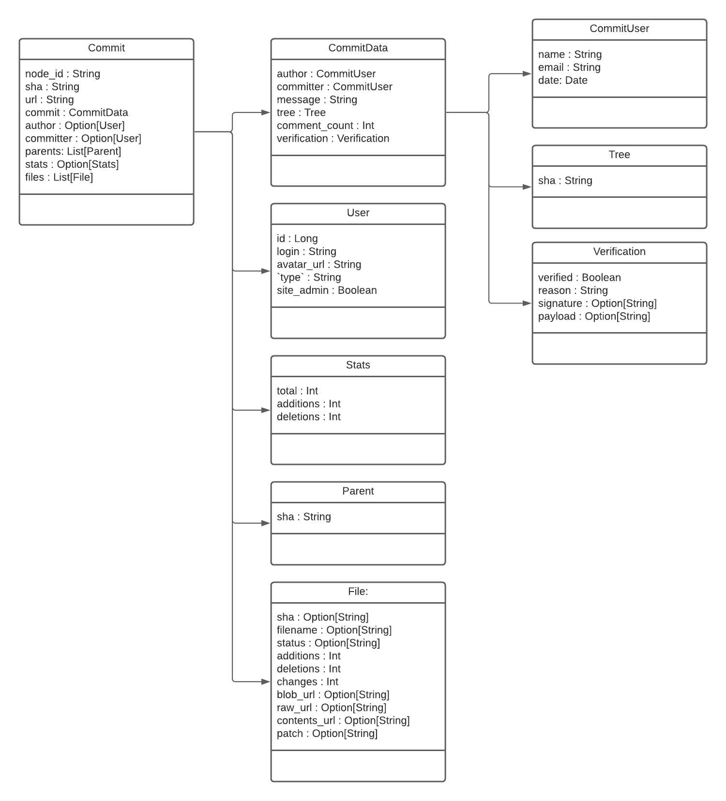
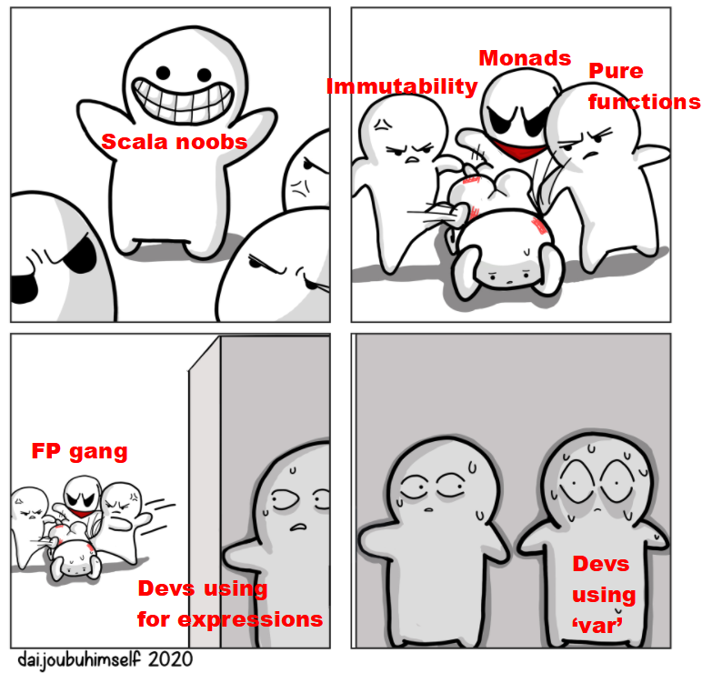

    # Assignment 2: Functional Programming
Welcome to the lab Functional Programming in Scala. This is the second
assignment of Big Data Processing, CSE2520.  

This lab was renewed and based upon earlier work done by Yoshi van den Akker. Whenever useful I simply copied over his
examples/work/text, sometimes with minor changes.

Author: Roald van der Heijden  
with credits to: Yoshi van den Akker  
Checked By : Akash

## Structure of the assignment
The assignment consists of 5 parts, worth 400 points in total:
**You are strongly advised to complete the parts in this order!!!**

### Part 1 - Basics - Functions and Lambdas (10 points)

This part shows how functions and anonymous functions are defined and used.
It displays basics of Scala and you will need to refer to other resources as
as well. Remember that the following resources are recommended, but not obligatory, except for the
lecture slides!
- Lecture slides on FP of the BDP course
- https://docs.scala-lang.org/tour/tour-of-scala.html
- The Scala API (this is where you'll DEFINITELY spend some time of this lab :))

If you're looking for books to read up on Scala I can recommend:
- *Functional Programming Simplified* by Alvin Alexander; It's definitely no
standard reading book, but I like his approach.
- [The Scala blog of Alvin Alexander](https://alvinalexander.com/scala/), the author of the above mentioned book; You can 
find ready made snippets here which help you learn faster.
- *Learning Scala 2nd ed.* by Vishal Layka & David Pollak; short, but good
- *Programming in Scala 4th ed.* by Martin Odersky, creator of Scala. (long, but
good. Skip chapter 1, but make sure to skim chapters 2,3,15. It'll help you for 
the Q3 - Concepts of Programming Languages as well.

### Part 2 - Lists and Pattern Matching (18 points)
This part teaches you about case matching in Scala. Case matching or pattern 
matching is basically if-else on steroids. You can *ONLY* use pattern matching in this part.  

Actually, we kind of cheat here... the `::` and `:::` shown are actually library
methods. You will need recursion, maybe define a helper method and to be fully 
functional we would have to forbid the use of `::` and `:::` (prepend an 
element to a list and list concatenation). But those are the only two library methods that are allowed in this assignment.  

### Part 3 - Rinse and Repeat - The Power of the API (12 points)
This parts goal is to get you to read and use the Scala API. It asks you to 
repeat earlier encountered questions, only this time using *ONLY* the Scala API

### Part 4 - More Functions (35 points)
This is the most challenging part of the assignment.
- you learned about functions and lambdas at this points
- you've seen pattern matching in actions
- you've been asked to read and use API functions (library methods)
- and I've shown (hopefully) a few good examples that are of intermediate difficulty

With all this under your belt. You are asked to solve some non-trivial problems.

### Part 5 - Dataset / Real Life Applications (25 points)

The slides mention Scala being de *de facto* language for big data processing.
To get you some experience we provide a few small real life examples. You are 
asked to solve questions using functional programming on a small dataset.

for the 3rd dataset assignment, an overview of the case class `Commit` has  
included:  

## About functional programming
In the lectures you learned about functional programming.
The most important characteristic is the absence of side-effects.
For all exercises in this assignment you are expected to program functionally.

## Undertaking the lab
The questions were made using Scastie, an online playground to play around
with Scala. Some devs are fan of having an IDE around, I'm more fan of the 
notebook/scratchpad approach. Some examples and tests are given in IntelliJ,
but I find having a sort of scratchpad available can really help building up 
your solution. These resources might help:
- [Scastie](https://scastie.scala-lang.org/) (authors preference)
- [ScalaFiddle](https://scalafiddle.io/) (seems more or less the same)
- IntelliJ Scala worksheet - if you can get it to work... it seems a bit buggy
- Scala's repl itself - fire up a terminal, run Scala, and start typing.

## Grading
### Grade calculation
All questions together add up to 400 points. Your grade for the assignment is `score/10`.

### Handing in your solutions
You can hand in your solutions on [Weblab](https://Weblab.tudelft.nl).
Create a ZIP archive of the `src/main/scala` folder and upload this to Weblab.

### Automatic grading
After handing in your solutions, you can see the results of the automatic grading.
This only shows you an overall grade and which question(s) is/are incorrect,
but will not give details of the failures.\
Note that the autograder contains more tests than the ones provided to you;
passing all provided tests does not mean you will get a 10.
You are encouraged to write more unit tests yourself to test your solutions.
You can find some help on writing tests in [test/intro/FunctionsTest.scala](<src/test/scala/intro/FunctionsTest.scala>)

**Warning**: the automatic grader may fail if you do any of the following actions:
- change the names of template files
- change function signatures
- use external dependencies that were not in the original `pom.xml` file
- hand in your solutions in another format than the one specified earlier.

If you are in doubt why the grader fails, ask the TAs for more details during the lab sessions.

### Manual correction on grade, i.e.  WARNING:
The autograder isn't that smart, so we might apply a negative correction on your grade
if we see you programming using for example 'var'. NO `var` is allowed anywhere in this lab,
for the same reason programming with for loops is prohibited. Failure to comply might lead to a deduction
in points for your grade. Also, hardcoding answers to the dataset is forbidden. If encountered, your grade for that
question will be set to 0. Consider this a fair warning!

### Note on Question 5b
You may notice that assignment that CPM does not show the points for assignment 5B,
if you have not filled in the method yet. This is default behavior,
it will become visible once it is filled.

### Programming style
The autograder only tests your solutions for correctness, it does not check your programming style.
Your solutions will be graded manually to verify you programmed functionally.
If not, points will be subtracted per question that violates the principles of FP.

Furthermore points may be deducted based on requirements set for the exercises, for example using library functions instead of implementing functions yourself.
These rules are specified in the template files, when applicable.\
When using library functions is not allowed, any function from the Scala List API is forbidden
except for `::` (or the equivalent `+:`) and `:::` (or `++` or `++:`).
Using `.map`, `.filter` or any other function from the API will result in points being subtracted from your grade.

Hint: in previous editions of the course the most common mistake was to use mutation (i.e. variables).
Mutation is a side effect, therefore it is not good practice when programming functionally.\
Note that `for` and `while` **loops** use mutation.

## Tools and setup

### IDE
We recommend using IntelliJ for this assignment. If you do not already have this, you can apply for a student license on the [Jetbrains website](https://www.jetbrains.com/student/) and afterwards download IntelliJ there.

If you want to use another IDE, you are free to do so. Do not expect support from TAs however.

### Maven
The template project you are given contains a POM file for dependency management.
Using Maven, all dependencies will be resolved automatically.

### Pre-requisites
1. Scala Plugin (See setup process)
2. Assignment requires Java jdk 1.8.

### Setup process
1. Install IntelliJ.
2. Install the Scala plugin (IntelliJ -> Settings/Preferences -> Plugins -> Marketplace, search for "Scala"). This will restart IntelliJ.
3. Import the template folder as a Maven project.
4. You are ready to start working, and remember... NO `var` :)

